# Watch Party Backend - Entity Relationship Diagram (ERD)

## Overview
This ERD shows all data models and their relationships in the Watch Party Backend system, including both implemented and planned features.

## Complete ERD Diagram

```mermaid
erDiagram
    %% Core User Management
    User ||--o{ UserProfile : has
    User ||--o{ UserAnalytics : tracks
    User ||--o{ UserSession : creates
    User ||--o{ MobileDevice : owns
    User ||--o{ PushSubscription : subscribes
    
    %% Authentication & Security
    User ||--o{ UserLoginHistory : logs
    User ||--o{ PasswordResetToken : requests
    User ||--o{ TwoFactorAuth : enables
    
    %% Video System
    User ||--o{ Video : uploads
    Video ||--o{ VideoComment : contains
    Video ||--o{ VideoLike : receives
    Video ||--o{ VideoView : tracked_by
    Video ||--o{ WatchTime : measures
    Video ||--o{ VideoAnalytics : analyzes
    Video ||--o{ VideoDownload : enables
    Video ||--o{ VideoProcessingJob : processes
    
    %% Video Comments & Interactions
    User ||--o{ VideoComment : posts
    VideoComment ||--o{ VideoComment : replies_to
    VideoComment ||--o{ CommentLike : receives
    User ||--o{ VideoLike : gives
    User ||--o{ CommentLike : gives
    
    %% Watch Party System
    User ||--o{ WatchParty : hosts
    WatchParty ||--o{ PartyParticipant : includes
    WatchParty ||--o{ PartyMessage : contains
    WatchParty ||--o{ PartyAnalytics : analyzes
    WatchParty ||--o{ PartyReport : reported_in
    WatchParty ||--o{ PartyInvitation : sends
    WatchParty }o--|| Video : plays
    
    %% Party Features
    User ||--o{ PartyParticipant : participates
    User ||--o{ PartyMessage : sends
    User ||--o{ PartyReport : files
    User ||--o{ PartyInvitation : receives
    User ||--o{ PartyReaction : reacts
    WatchParty ||--o{ PartyReaction : contains
    
    %% Interactive Features
    WatchParty ||--o{ Poll : contains
    Poll ||--o{ PollOption : has
    Poll ||--o{ PollVote : receives
    User ||--o{ PollVote : casts
    User ||--o{ Poll : creates
    
    WatchParty ||--o{ ScreenShare : enables
    User ||--o{ ScreenShare : initiates
    WatchParty ||--o{ VoiceChat : supports
    User ||--o{ VoiceChatParticipant : joins
    
    %% Events Management System
    User ||--o{ Event : organizes
    Event ||--o{ EventAttendee : includes
    Event ||--o{ EventInvitation : sends
    User ||--o{ EventAttendee : attends
    User ||--o{ EventInvitation : receives
    User ||--o{ EventRSVP : responds
    Event ||--o{ EventRSVP : collects
    
    %% Social Features
    User ||--o{ SocialGroup : administers
    SocialGroup ||--o{ GroupMembership : contains
    User ||--o{ GroupMembership : participates
    User ||--o{ Friendship : initiates
    User ||--o{ Friendship : receives
    User ||--o{ UserBlock : blocks
    User ||--o{ UserFollow : follows
    
    %% Messaging System
    User ||--o{ Conversation : participates_in
    Conversation ||--o{ Message : contains
    User ||--o{ Message : sends
    Message ||--o{ MessageReaction : receives
    User ||--o{ MessageReaction : gives
    Message ||--o{ MessageAttachment : includes
    
    %% Notifications
    User ||--o{ Notification : receives
    User ||--o{ NotificationPreference : sets
    User ||--o{ EmailNotification : gets
    User ||--o{ PushNotification : receives
    
    %% Billing & Subscriptions
    User ||--o{ Subscription : subscribes
    User ||--o{ Payment : makes
    Subscription ||--o{ Payment : requires
    User ||--o{ Invoice : receives
    Payment ||--o{ Invoice : generates
    
    %% Support System
    User ||--o{ SupportTicket : creates
    SupportTicket ||--o{ TicketReply : contains
    User ||--o{ TicketReply : sends
    User ||--o{ FAQ : reads
    User ||--o{ Feedback : provides
    
    %% Content Moderation
    User ||--o{ ContentReport : files
    ContentReport }o--|| Video : reports
    ContentReport }o--|| WatchParty : reports
    ContentReport }o--|| User : reports
    User ||--o{ ModerationAction : receives
    User ||--o{ ContentFlag : triggers
    
    %% Analytics & Tracking
    User ||--o{ AnalyticsEvent : generates
    User ||--o{ WatchTime : accumulates
    User ||--o{ UserBehaviorAnalytics : tracked_by
    Video ||--o{ VideoEngagementAnalytics : measures
    WatchParty ||--o{ PartyEngagementAnalytics : tracks
    
    %% Mobile App Support
    User ||--o{ MobileDevice : registers
    MobileDevice ||--o{ MobileSyncData : syncs
    MobileDevice ||--o{ MobileAppCrash : reports
    MobileDevice ||--o{ MobileAnalytics : tracks
    
    %% Search & Discovery
    User ||--o{ SearchQuery : performs
    SearchQuery ||--o{ SearchResult : returns
    User ||--o{ SavedSearch : creates
    User ||--o{ ContentRecommendation : receives
    
    %% Store & Achievements
    User ||--o{ UserAchievement : unlocks
    User ||--o{ VirtualCurrency : earns
    User ||--o{ StoreTransaction : makes
    User ||--o{ UserInventory : maintains
    
    %% System Management
    User ||--o{ SystemLog : generates
    User ||--o{ PerformanceMetric : contributes_to
    User ||--o{ ErrorLog : creates
    
    %% Entity Definitions
    User {
        uuid id PK
        string username
        string email
        string password_hash
        string first_name
        string last_name
        boolean is_active
        boolean is_staff
        boolean is_superuser
        datetime date_joined
        datetime last_login
        json settings
    }
    
    UserProfile {
        uuid id PK
        uuid user_id FK
        string avatar
        text bio
        string country
        string timezone
        date birth_date
        string phone
        boolean is_verified
        json privacy_settings
    }
    
    Video {
        uuid id PK
        uuid uploaded_by_id FK
        string title
        text description
        string file_path
        string thumbnail
        duration duration
        string status
        string category
        boolean is_public
        integer view_count
        json metadata
        datetime created_at
        datetime updated_at
    }
    
    VideoComment {
        uuid id PK
        uuid video_id FK
        uuid user_id FK
        uuid parent_id FK
        text content
        boolean is_edited
        integer likes_count
        datetime created_at
        datetime updated_at
    }
    
    VideoLike {
        uuid id PK
        uuid video_id FK
        uuid user_id FK
        boolean is_like
        datetime created_at
    }
    
    WatchParty {
        uuid id PK
        uuid host_id FK
        uuid video_id FK
        string title
        text description
        string status
        datetime scheduled_start
        datetime actual_start
        datetime ended_at
        integer max_participants
        string visibility
        json settings
        datetime created_at
        datetime updated_at
    }
    
    PartyParticipant {
        uuid id PK
        uuid party_id FK
        uuid user_id FK
        boolean is_active
        datetime joined_at
        datetime left_at
        string role
        json preferences
    }
    
    PartyMessage {
        uuid id PK
        uuid party_id FK
        uuid user_id FK
        text content
        string message_type
        json metadata
        datetime sent_at
    }
    
    Event {
        uuid id PK
        uuid organizer_id FK
        string title
        text description
        datetime start_time
        datetime end_time
        string location
        integer max_attendees
        boolean require_approval
        boolean is_public
        string status
        string category
        json settings
        datetime created_at
        datetime updated_at
    }
    
    EventAttendee {
        uuid id PK
        uuid event_id FK
        uuid user_id FK
        string status
        datetime joined_at
        json preferences
    }
    
    EventInvitation {
        uuid id PK
        uuid event_id FK
        uuid inviter_id FK
        uuid invitee_id FK
        string status
        text message
        datetime sent_at
        datetime responded_at
    }
    
    Poll {
        uuid id PK
        uuid party_id FK
        uuid creator_id FK
        string question
        boolean is_active
        duration duration
        datetime created_at
        datetime expires_at
    }
    
    PollOption {
        uuid id PK
        uuid poll_id FK
        string text
        integer votes_count
        integer order
    }
    
    PollVote {
        uuid id PK
        uuid poll_id FK
        uuid option_id FK
        uuid user_id FK
        datetime voted_at
    }
    
    SocialGroup {
        uuid id PK
        uuid admin_id FK
        string name
        text description
        boolean is_private
        string category
        integer member_count
        json settings
        datetime created_at
        datetime updated_at
    }
    
    GroupMembership {
        uuid id PK
        uuid group_id FK
        uuid user_id FK
        string role
        string status
        datetime joined_at
        json permissions
    }
    
    Friendship {
        uuid id PK
        uuid requester_id FK
        uuid addressee_id FK
        string status
        datetime created_at
        datetime accepted_at
    }
    
    Conversation {
        uuid id PK
        string conversation_type
        string title
        boolean is_group
        json settings
        datetime created_at
        datetime updated_at
    }
    
    Message {
        uuid id PK
        uuid conversation_id FK
        uuid sender_id FK
        text content
        string message_type
        boolean is_edited
        json metadata
        datetime sent_at
        datetime edited_at
    }
    
    Notification {
        uuid id PK
        uuid user_id FK
        string title
        text message
        string notification_type
        boolean is_read
        json data
        datetime created_at
        datetime read_at
    }
    
    Subscription {
        uuid id PK
        uuid user_id FK
        string plan_type
        string status
        decimal amount
        string currency
        datetime start_date
        datetime end_date
        boolean auto_renew
        json features
    }
    
    Payment {
        uuid id PK
        uuid user_id FK
        uuid subscription_id FK
        decimal amount
        string currency
        string status
        string payment_method
        string transaction_id
        json metadata
        datetime created_at
        datetime processed_at
    }
    
    SupportTicket {
        uuid id PK
        uuid user_id FK
        uuid assigned_to_id FK
        string subject
        text description
        string status
        string priority
        string category
        text admin_notes
        datetime created_at
        datetime updated_at
        datetime resolved_at
    }
    
    TicketReply {
        uuid id PK
        uuid ticket_id FK
        uuid user_id FK
        text content
        boolean is_internal
        json attachments
        datetime created_at
    }
    
    MobileDevice {
        uuid id PK
        uuid user_id FK
        string device_id
        string platform
        string model
        string os_version
        string app_version
        string push_token
        boolean push_enabled
        datetime last_sync
        datetime last_active
        boolean is_active
        json settings
    }
    
    MobileSyncData {
        uuid id PK
        uuid device_id FK
        string sync_type
        string sync_status
        json data_types
        integer data_size_bytes
        integer records_count
        datetime started_at
        datetime completed_at
        integer duration_seconds
        text error_message
        integer retry_count
    }
    
    AnalyticsEvent {
        uuid id PK
        uuid user_id FK
        uuid video_id FK
        uuid party_id FK
        string event_type
        string event_name
        json event_data
        string session_id
        string ip_address
        string user_agent
        datetime timestamp
    }
    
    WatchTime {
        uuid id PK
        uuid user_id FK
        uuid video_id FK
        uuid party_id FK
        integer total_watch_time
        integer last_position
        float completion_percentage
        string average_quality
        integer buffering_events
        datetime created_at
        datetime updated_at
    }
    
    ContentReport {
        uuid id PK
        uuid reporter_id FK
        string content_type
        uuid object_id
        string report_type
        text description
        string status
        text admin_notes
        datetime created_at
        datetime resolved_at
    }
    
    UserAchievement {
        uuid id PK
        uuid user_id FK
        string achievement_type
        string achievement_name
        text description
        json metadata
        datetime unlocked_at
    }
    
    SearchQuery {
        uuid id PK
        uuid user_id FK
        string query_text
        string search_type
        json filters
        integer results_count
        datetime created_at
    }
    
    SystemLog {
        uuid id PK
        uuid user_id FK
        string log_level
        string category
        text message
        json context
        datetime created_at
    }
```



## Key Relationships Summary

### Core User System
- **User** is the central entity connecting to all other systems
- **UserProfile** extends user information with additional details
- **UserAnalytics** tracks user behavior and engagement

### Video & Content System
- **Video** is uploaded by users and can be played in watch parties
- **VideoComment** supports threaded discussions with parent-child relationships
- **VideoLike** tracks user engagement with videos
- **WatchTime** measures viewing behavior for analytics

### Watch Party System
- **WatchParty** is hosted by users and plays videos
- **PartyParticipant** manages user participation in parties
- **PartyMessage** enables real-time chat during parties
- **PartyReaction** tracks user reactions and engagement

### Interactive Features
- **Poll** system with options and votes for party engagement
- **ScreenShare** and **VoiceChat** for enhanced collaboration
- Real-time features integrated with WebSocket connections

### Events Management
- **Event** system for scheduling and organizing gatherings
- **EventAttendee** and **EventInvitation** manage participation
- **EventRSVP** tracks responses to event invitations

### Social Features
- **SocialGroup** for community building
- **Friendship** system with request/accept workflow
- **Conversation** and **Message** for private communications

### Mobile Support
- **MobileDevice** registration and management
- **MobileSyncData** for offline synchronization
- **MobileAnalytics** for mobile-specific tracking

### Support & Moderation
- **SupportTicket** system with replies and escalation
- **ContentReport** for community moderation
- **ModerationAction** for admin interventions

### Analytics & Business Intelligence
- **AnalyticsEvent** for comprehensive event tracking
- **WatchTime** for detailed viewing analytics
- Various engagement analytics for different content types

### Billing & Monetization
- **Subscription** and **Payment** for premium features
- **UserAchievement** and rewards system
- **VirtualCurrency** for in-app purchases

## Implementation Status

### ✅ Fully Implemented
- Core user management (User, UserProfile)
- Basic video system (Video, partial analytics)
- Watch party system (WatchParty, ParticipantParty)
- Basic analytics (AnalyticsEvent, some tracking)
- Mobile app support (MobileDevice, sync systems)
- Enhanced admin panel features
- Response standardization system

### 🚧 Partially Implemented
- Interactive features (basic structure exists)
- Notifications system (basic implementation)
- Analytics (basic tracking, enhanced features added)
- Billing system (basic structure)

### ❌ Not Yet Implemented (High Priority)
- Video comments system (VideoComment, CommentLike)
- Video likes/ratings (VideoLike)
- Events management (Event, EventAttendee, EventInvitation)
- Social groups (SocialGroup, GroupMembership)
- Support ticket system (SupportTicket, TicketReply)
- Advanced interactive features (Poll, ScreenShare, VoiceChat)

### ❌ Not Yet Implemented (Medium Priority)
- Enhanced search system
- Content moderation tools
- Advanced messaging features
- Achievements and gamification
- Advanced billing features

## Database Considerations

### Indexes Needed
```sql
-- User system
CREATE INDEX idx_user_email ON users(email);
CREATE INDEX idx_user_username ON users(username);
CREATE INDEX idx_user_last_login ON users(last_login);

-- Video system
CREATE INDEX idx_video_status ON videos(status);
CREATE INDEX idx_video_category ON videos(category);
CREATE INDEX idx_video_uploaded_by ON videos(uploaded_by_id);
CREATE INDEX idx_video_created_at ON videos(created_at);

-- Watch parties
CREATE INDEX idx_party_host ON watch_parties(host_id);
CREATE INDEX idx_party_status ON watch_parties(status);
CREATE INDEX idx_party_scheduled_start ON watch_parties(scheduled_start);

-- Analytics
CREATE INDEX idx_analytics_user_timestamp ON analytics_events(user_id, timestamp);
CREATE INDEX idx_analytics_event_type ON analytics_events(event_type);
CREATE INDEX idx_watch_time_user_video ON watch_times(user_id, video_id);

-- Mobile
CREATE INDEX idx_mobile_device_user ON mobile_devices(user_id);
CREATE INDEX idx_mobile_device_id ON mobile_devices(device_id);
```

### Performance Optimizations
- Use database partitioning for large analytics tables
- Implement read replicas for analytics queries
- Use Redis for caching frequently accessed data
- Implement connection pooling for database connections

## API Endpoints Coverage

This ERD supports all the API endpoints mentioned in the TODO list:

### Video System
- `GET/POST /api/videos/` ✅
- `GET/POST /api/videos/{id}/comments/` (VideoComment) ❌
- `POST /api/videos/{id}/like/` (VideoLike) ❌
- `GET /api/videos/{id}/download/` ✅

### Events System
- `GET/POST /api/events/` (Event) ❌
- `GET/PUT/DELETE /api/events/{id}/` (Event) ❌
- `POST /api/events/{id}/join/` (EventAttendee) ❌

### Mobile System
- `GET /api/mobile/config/` ✅
- `GET /api/mobile/home/` ✅
- `POST /api/mobile/sync/` (MobileSyncData) ✅

### Admin System
- `GET /api/admin/users/` ✅
- `POST /api/admin/users/export/` ✅
- `GET /api/admin/system-health/` ✅
- `POST /api/admin/broadcast/` ✅

### Analytics System
- `GET /api/analytics/video/{id}/analytics/` ✅
- `GET /api/analytics/user-behavior/` ✅
- `GET /api/analytics/real-time/` ✅
- `GET /api/analytics/predictive/` ✅

This ERD provides a complete blueprint for the Watch Party Backend system, covering all current implementations and future requirements outlined in the TODO list.
